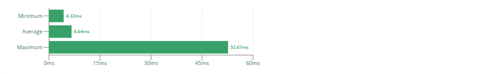
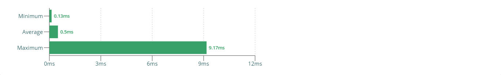
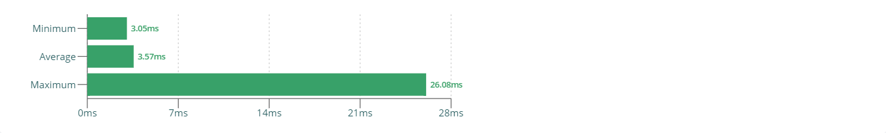
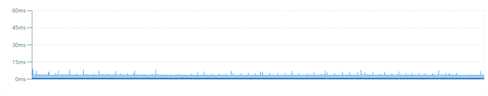
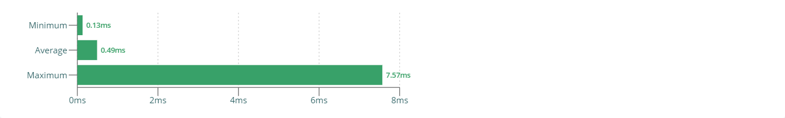

# javascript-video-processing-experiment

JavaScript real-time video processing using Canvas.

   

## TODO

Notes:

- rAF loop
  - timeupdated no reliable
- Video must be in visible screen area, and tab must be active
- createImageBitmap() is very slow (https://developer.mozilla.org/en-US/docs/Web/API/WindowOrWorkerGlobalScope/createImageBitmap)
- WebM instead of e.g. MP4 due to Chromium vs. Chrome (see https://pptr.dev/)
- Weirdly high numbers when running headless

Source:

- URL: http://bbb3d.renderfarming.net/download.html
- Video URL: http://distribution.bbb3d.renderfarming.net/video/mp4/bbb_sunflower_1080p_30fps_normal.mp4

// https://stackoverflow.com/questions/12250953/drawing-an-image-using-webgl
// https://stackoverflow.com/questions/9857089/flip-upside-down-vertex-shader-gles
// https://developer.mozilla.org/en-US/docs/Web/API/WebGL_API/Tutorial/Animating_textures_in_WebGL

https://emscripten.org/docs/optimizing/Optimizing-WebGL.html

  

## Performance Analysis

### Summary

#### Test parameters

We are running the performance analysis with the following parameters:

- We play a 30 second 1080p video and extract raw pixels on every browser render cycle

#### Test results (summary)

The following table shows a short test summary. See further chapters for more details.

| Test case                | Duration | Render duration | Extract duration | Comparison (duration) |
| ------------------------ | -------- | --------------- | ---------------- | --------------------- |
| 2D Canvas                | ~6.64ms  | ~0.49ms         | ~6.15ms          | 100% (baseline)       |
| WebGL Canvas (Variant 1) | ~4.06ms  | ~0.50ms         | ~3.57ms          | 61.14%                |
| WebGL Canvas (Variant 2) | ~4.05ms  | ~0.49ms         | ~3.56ms          | 61.00%                |

#### Interpretation of results

- Using a WebGL canvas generally shortens the overall duration by a factor of 1.66.
- There is no visible performance difference between both WebGL implementations.
- Overall, render duration stays consistent across all test cases; only pixel extraction seems to be faster when using WebGL.

#### Recommendations

While the performnace improvement is alright, the improvement in actual numbers - here possibly around _2.5ms_ - is a good reason to switch
to a WebGL-based solution, especially when keeping the usual frame budget (_16.66ms_) in mind.

 

### Test case: 2D Canvas

In this test case, we use a simple [2D canvas](https://developer.mozilla.org/de/docs/Web/API/CanvasRenderingContext2D) to render the video
frame into and extract raw pixels from.

> Implementation pointer:
> [Video Processor](https://github.com/dominique-mueller/javascript-video-processing-experiment/blob/master/packages/canvas-2d/src/video-processor.ts#L4)

#### Timeline

The following chart shows that durations are generally follow an average, although quite a few spikes in both directions exist at times.

#### Durations

The average duration is around _6.6ms_ to _6.7ms_, with a few durations being slightly faster and some durations being significantly slower.

#### Render durations

Rendering a video frame into a 2D canvas is generally very fast, taking about _0.5ms_. A few times, rendering happens faster, and at times very slowly. Compared to the whole duration, the rendering step only accounts for a small amount of the overall time.

#### Extract durations

Reading raw pixels from an image rendered into a 2D canvas is generally very slow, taking between _6.1ms_ and _6.2ms_. A few times, the pixel extraction happens a bit faster, other times it takes up considerable more time. Overall, this step is the main reason for the overall slow process.

#### Tracing

This tracing profile looks fairly clean, the GPU access time can be clearly seen here.

 

### Test case: WebGL Canvas (Variant 1)

In this test case, we use a [WebGL canvas](https://developer.mozilla.org/de/docs/Web/API/WebGLRenderingContext) to render the video frame
into and extract raw pixels from.

> Implementation pointer:
> [Video Processor](https://github.com/dominique-mueller/javascript-video-processing-experiment/blob/master/packages/webgl-variant-1/src/video-processor.ts#L4)

#### Timeline

The following chart shows that durations are generally follow an average, although very few spikes in both directions exist at times.

#### Durations

The average duration is around _4.0ms_ to _4.1ms_, with a few durations being slightly faster and some durations being significantly slower.

#### Render durations

Rendering a video frame into a 2D canvas is generally very fast, taking about _0.5ms_. A few times, rendering happens faster, and at times very slowly. Compared to the whole duration, the rendering step only accounts for a small amount of the overall time.

#### Extract durations

Reading raw pixels from an image rendered into a 2D canvas is generally slow, taking between _3.5ms_ and _3.6ms_. A few times, the pixel extraction happens a tiny bit faster, other times it takes up considerable more time. Overall, this step is the main reason for the overall slow process.

#### Tracing

This tracing profile looks fairly clean, the GPU access time can be clearly seen here.

 

### Test case: WebGL Canvas (Variant 2)

In this test case, we use a [WebGL canvas](https://developer.mozilla.org/de/docs/Web/API/WebGLRenderingContext) to render the video frame
into and extract raw pixels from.

> Implementation pointer:
> [Video Processor](https://github.com/dominique-mueller/javascript-video-processing-experiment/blob/master/packages/webgl-variant-2/src/video-processor.ts#L4)

#### Timeline

The following chart shows that durations are generally follow an average, although very few spikes in both directions exist at times.

#### Durations

The average duration is around _4.0ms_ to _4.1ms_, with a few durations being slightly faster and some durations being significantly slower.

#### Render durations

Rendering a video frame into a 2D canvas is generally very fast, taking about _0.5ms_. A few times, rendering happens faster, and at times very slowly. Compared to the whole duration, the rendering step only accounts for a small amount of the overall time.

#### Extract durations

Reading raw pixels from an image rendered into a 2D canvas is generally slow, taking between _3.5ms_ and _3.6ms_. A few times, the pixel extraction happens a tiny bit faster, other times it takes up considerable more time. Overall, this step is the main reason for the overall slow process.

#### Tracing

This tracing profile looks fairly clean, the GPU access time can be clearly seen here.

