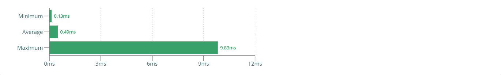
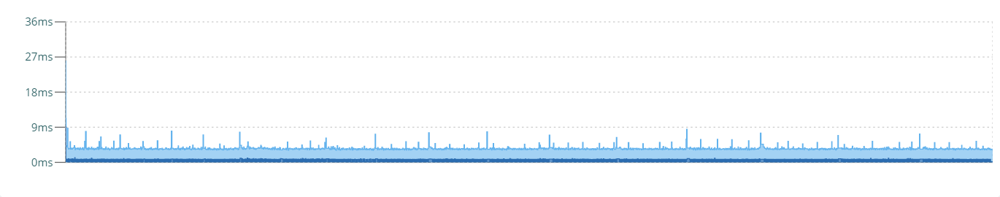

# javascript-video-processing-experiment

JavaScript real-time video processing using Canvas (2D, WebGL).

   

## Video Processing: Extracting pixels from video each frame

Because the web is not primarily designed for video processing, not many APIs exist that can support us here. But why would we even want to
do this? Use cases include:

- Video effects (e.g. filters, real-time greenscreen, face detection / blur via AI)
- WebRTC: Synchronizing metadata with video frames requires frame information to be encoded into and extracted from the video itself as
  there is no othe technical way to connect frames and metadata (see
  [this](https://stackoverflow.com/questions/30391939/synchronization-of-data-with-video-using-webrtc) and
  [that](https://stackoverflow.com/questions/30432011/passing-real-time-metadata-synchronized-with-video-frames-using-webrtc-and-text))

 

### Knowing about video frame changes

Sadly, there is no way for us to know when the browser renders the next video frame. There is a
[`timeupdate`](https://developer.mozilla.org/en-US/docs/Web/API/HTMLMediaElement/timeupdate_event) event on the video element which at first
sight might seem like a solution. But (presumably for performance reasons?), that event triggers unpredictably and therefore does not ensure
that every frame will be captured (see [video.js#4322](https://github.com/videojs/video.js/issues/4322),
[this Bugzilla bug](https://bugzilla.mozilla.org/show_bug.cgi?id=571822)).

Instead, we have to rely on the browser render cycle. We can use a `requestAnimationFrame()` loop to constantly process the current video
frame.

> In the test case implementations, we just go ahead and process every frame, no matter whether it actually changed. Further optimizations
> might help reduce the load on the main thread.

 

### Reading raw pixels from video frame

There is no direct way to read raw pixels from a video, or a video frame. Instead:

- We create an in-memory canvas element (2D or WebGL)
- Render step: We render the current video frame into the canvas element by defining the video element as a source (rather implicit, but it works as
  intended)
- Extraction step: We read all raw pixels from the canvas element

Side note: There is an API that allows us to get the current video frame as an image named
[`createImageBitmap`](https://developer.mozilla.org/en-US/docs/Web/API/WindowOrWorkerGlobalScope/createImageBitmap). Sadly, we cannot
process this image any futher but would have to go through the canvas again. Adding to that, `createImageBitmap()` seems to be really really
slow.

> The test case implementations do not yet consider multi-threaded solutions like
> [`OffscreenCanvas`](https://developer.mozilla.org/en-US/docs/Web/API/OffscreenCanvas), primarily due to the
> [still very bad browser support](https://caniuse.com/#feat=offscreencanvas).

#### The magic (or horror) that is WebGL

Time for honesty: I have no clue about WebGL. It took me a few days to copy-paste and trial-error (mostly error) together those both test
cases using WebGL. Resources I used include:

- https://stackoverflow.com/questions/12250953/drawing-an-image-using-webgl
- https://stackoverflow.com/questions/9857089/flip-upside-down-vertex-shader-gles
- https://emscripten.org/docs/optimizing/Optimizing-WebGL.html
- https://developer.mozilla.org/en-US/docs/Web/API/WebGL_API/Tutorial/Animating_textures_in_WebGL

 

### Video element

When using video elements, there is a bunch of browser behaviour that we need to keep in mind. Interesting here is:

- In order for the canvas element to use the video (the frame, in particular) as a source, the video needs to be rendered somewhere into the
  DOM, it cannot just exist in-memory.
- To ensure that the video auto-plays (and continues to do si), it must reside in the visible screen area. Therefore, the video element must
  not be hidden via the `hidden` attribute or a `display: none` rule. Using `position: fixed` and an
  [accessible hide solution](https://a11yproject.com/posts/how-to-hide-content/) based on `visibility: hidden` works, though.
- The browser might decide to not render the video if the tab is not active & not visible to save energy. The `requestAnimationFrame()` API,
  however, contionues to get called as per usual.

   

## Performance Analysis Setup & Implementation

### Video file

As the test video file, we use the ["Big Buck Bunny"](https://peach.blender.org/) short animated movie, in particular the 2D Full HD
(1920x1080) 30fps version.

> Source:
>
> - Website for downloads: http://bbb3d.renderfarming.net/download.html
> - Specific URL for video: http://distribution.bbb3d.renderfarming.net/video/mp4/bbb_sunflower_1080p_30fps_normal.mp4

The video file got prepared by

- cutting out a 30 second long clip from the full video that contains different types of animations and various cuts, using
  [lossless-cut](https://github.com/mifi/lossless-cut)
- converting the `.mp4` file into a `.webm` file so that it works with the Chromium instance that puppeteer installs (see
  [puppeteer#291](https://github.com/puppeteer/puppeteer/issues/291)), using the
  [Adobe Media Encoder](https://www.adobe.com/de/products/media-encoder.html) with the [WebM Plugin](https://www.fnordware.com/WebM/)

 

### Test setup

Of course, we want to get meaningful and consistent results when performance analysis each use case implementation. The following has been
done to ensure this:

- **All use case implementations are completely separated from each other.**
   
  Sure, it's a lot of duplicate code and tons of storage used by `node_modules` folders, but it keeps things clean. In particular:
  - Each use case implementation exists within a separete folder, and no code gets shared between use cases. This way, we can ensure that
    the implementation is kept to the absolute minimum, e.g. only the relevant video processor, no unnecessary logic or "pages".
  - Each use case defines and installs its own dependencies, and thus has its own `node_modules` folder. This way, we can easily run our
    performance analysis tests using different dependencies per use case.
- **Performance analysis happens on a production build of the application.**
   
  That's the version our users will see, so that's the version we should test. In particular:
  - Production builds might perform better (or at least different) than development builds due things like tree shaking, dead code
    elimination and minification.
- **Performance analysis happens with the exact same clean browser.**
   
  Let's keep variations to a minimum. In particular:
  - We use the exact same version of Chrome for all tests, ensuring consistent results.
  - We use a clean version of Chrome so that things like user profiles, settings or extensions / plugins don't affect the results.

While all this certainly helps getting solid test results, there will always be things out of our control, such as:

- Browser stuff (e.g. garbage collection, any internal delays)
- Software stuff (Windows, software running in the background)
- Hardware stuff (CPU, GPU, RAM, storage)

All the performance profiling results documented below ran on the following system:

| Area             | Details                                               |
| ---------------- | ----------------------------------------------------- |
| CPU              | Intel Core i7 8700K 6x 3.70Ghz                        |
| RAM              | 32GB DDR4-3200 DIMM CL16                              |
| GPU              | NVIDIA GeForce GTX 1070 8GB                           |
| Storage          | System: 512GB NVMe M.2 SSD, Project: 2TB 7.200rpm HDD |
| Operating System | Windows 10 Pro, Version 1909, Build 18363.778         |

 

### Test implementation

Within each test case implementation, the `start-analysis.bin.ts` script is responsible for executing the performance analysis and writing
the results onto the disk.

In particular, it follows these steps:

| Step | Description                                                                 |
| ---- | --------------------------------------------------------------------------- |
| 1    | Start the server that serves the frontend application build locally         |
| 2    | Start the browser, and navigate to the URL serving the frontend application |
| 3    | Start the browser performance profiler recording                            |
| -    | Wait for the test to finish                                                 |
| 4    | Stop the browser performance profiler recording                             |
| 5    | Write results to disk                                                       |
| 6    | Close browser                                                               |
| 7    | Close server                                                                |

> Internally, we use [Puppeteer](https://github.com/puppeteer/puppeteer) to control a browser, and use the native NodeJS server API to serve
> the fronted to that browser.

> **Heads up!** 
> For some reason, Chrome produces extremely high profiling values when running in headless mode. Thus, all tests are being executed with
> headless mode disabled.

 

### How to run a test

To run a performance analysis on a use case, follow these steps:

1. Install dependencies by running `npm run install`
2. Create a production build by running `npm run build`
3. Run the performance analysis by running `npm run start:analysis`

The script will create the following two files within the `results` folder:

- `profiler-logs.json` contains the React profiler results
   
  The root project is a React app that offers a visualization of this file in the form of charts. Simply run `npm start` and select a
  `profiler-logs.json` file.
- `tracing-profile.json` contains the browser performance tracing timeline
   
  This file can be loaded into the "Performance" tab of the Chrome Dev Tools, or can be uploaded to and viewed online using the
  [DevTools Timeline Viewer](https://chromedevtools.github.io/timeline-viewer/)

   

## Performance Analysis

### Summary

#### Test parameters

We are running the performance analysis with the following parameters:

- We play a 30 second 1080p video and extract raw pixels on every browser render cycle

#### Test results (summary)

The following table shows a short test summary. See further chapters for more details.

| Test case                                                     | Duration | Render duration | Extract duration | Comparison (duration) |
| ------------------------------------------------------------- | -------- | --------------- | ---------------- | --------------------- |
| [2D Canvas](#test-case-2d-canvas)                             | ~6.64ms  | ~0.49ms         | ~6.15ms          | 100% (baseline)       |
| [WebGL Canvas (Variant 1)](#test-case-webgl-canvas-variant-1) | ~4.06ms  | ~0.50ms         | ~3.57ms          | 61.14%                |
| [WebGL Canvas (Variant 2)](#test-case-webgl-canvas-variant-2) | ~4.05ms  | ~0.49ms         | ~3.56ms          | 61.00%                |

#### Interpretation of results

- Using a WebGL canvas generally shortens the overall duration by a factor of 1.66.
- There is no visible performance difference between both WebGL implementations.
- The tracing profile suggest what WebGL-based solutions perform more consistent than a 2D canvas (fewer duration spikes).
- Overall, render duration stays consistent across all test cases; only pixel extraction seems to be faster when using WebGL.

#### Recommendations

While the performnace improvement is alright, the improvement in actual numbers - here possibly around _2.5ms_ - is a good reason to switch
to a WebGL-based solution, especially when keeping the usual frame budget (_16.66ms_) in mind.

 

### Test case: 2D Canvas

In this test case, we use a simple [2D canvas](https://developer.mozilla.org/de/docs/Web/API/CanvasRenderingContext2D) to render the video
frame into and extract raw pixels from.

> Implementation pointer:
> [Video Processor](https://github.com/dominique-mueller/javascript-video-processing-experiment/blob/master/packages/canvas-2d/src/video-processor.ts#L4)

#### Timeline

The following chart shows that durations are generally follow an average, although quite a few spikes in both directions exist at times.

#### Durations

The average duration is around _6.6ms_ to _6.7ms_, with a few durations being slightly faster and some durations being significantly slower.

#### Render durations

Rendering a video frame into a 2D canvas is generally very fast, taking about _0.5ms_. A few times, rendering happens faster, and at times very slowly. Compared to the whole duration, the rendering step only accounts for a small amount of the overall time.

#### Extract durations

Reading raw pixels from an image rendered into a 2D canvas is generally very slow, taking between _6.1ms_ and _6.2ms_. A few times, the pixel extraction happens a bit faster, other times it takes up considerable more time. Overall, this step is the main reason for the overall slow process.

#### Tracing

This tracing profile looks fairly clean, the GPU access time can be clearly seen here.

 

### Test case: WebGL Canvas (Variant 1)

In this test case, we use a [WebGL canvas](https://developer.mozilla.org/de/docs/Web/API/WebGLRenderingContext) to render the video frame
into and extract raw pixels from.

> Implementation pointer:
> [Video Processor](https://github.com/dominique-mueller/javascript-video-processing-experiment/blob/master/packages/webgl-variant-1/src/video-processor.ts#L4)

#### Timeline

The following chart shows that durations are generally follow an average, although very few spikes in both directions exist at times.

#### Durations

The average duration is around _4.0ms_ to _4.1ms_, with a few durations being slightly faster and some durations being significantly slower.

#### Render durations

Rendering a video frame into a 2D canvas is generally very fast, taking about _0.5ms_. A few times, rendering happens faster, and at times very slowly. Compared to the whole duration, the rendering step only accounts for a small amount of the overall time.

#### Extract durations

Reading raw pixels from an image rendered into a 2D canvas is generally slow, taking between _3.5ms_ and _3.6ms_. A few times, the pixel extraction happens a tiny bit faster, other times it takes up considerable more time. Overall, this step is the main reason for the overall slow process.

#### Tracing

This tracing profile looks fairly clean, the GPU access time can be clearly seen here.

 

### Test case: WebGL Canvas (Variant 2)

In this test case, we use a [WebGL canvas](https://developer.mozilla.org/de/docs/Web/API/WebGLRenderingContext) to render the video frame
into and extract raw pixels from.

> Implementation pointer:
> [Video Processor](https://github.com/dominique-mueller/javascript-video-processing-experiment/blob/master/packages/webgl-variant-2/src/video-processor.ts#L4)

#### Timeline

The following chart shows that durations are generally follow an average, although very few spikes in both directions exist at times.

#### Durations

The average duration is around _4.0ms_ to _4.1ms_, with a few durations being slightly faster and some durations being significantly slower.

#### Render durations

Rendering a video frame into a 2D canvas is generally very fast, taking about _0.5ms_. A few times, rendering happens faster, and at times very slowly. Compared to the whole duration, the rendering step only accounts for a small amount of the overall time.

#### Extract durations

Reading raw pixels from an image rendered into a 2D canvas is generally slow, taking between _3.5ms_ and _3.6ms_. A few times, the pixel extraction happens a tiny bit faster, other times it takes up considerable more time. Overall, this step is the main reason for the overall slow process.

#### Tracing

This tracing profile looks fairly clean, the GPU access time can be clearly seen here.

